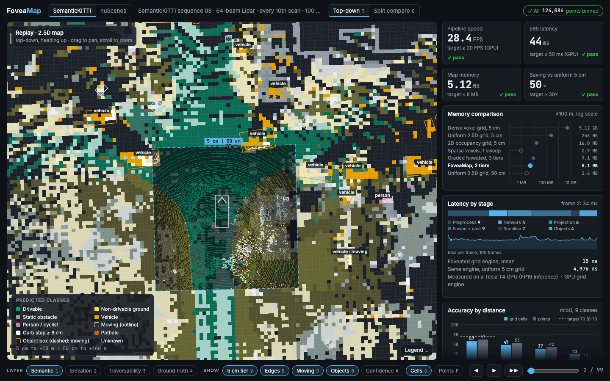

# FoveaMap

**Foveated 2.5D semantic mapping from Lidar, in real time.** FoveaMap keeps 5 cm cells within ±10 m of the vehicle and 50 cm cells out to ±100 m: fine detail where the vehicle is about to drive, 50× less memory than a uniform 5 cm grid. On top of the height map it labels every cell's class, motion, terrain hazards (curbs, potholes, overhangs) and traversability cost, and groups obstacles into classified objects. Built for Smart India Hackathon problem **SIH26053** (DRDO), *Adaptive Variable Resolution 2.5D Lidar Mapping for Dynamic Environment Perception*.

[](https://foveamap-teal.vercel.app) [](https://colab.research.google.com/github/ammar-iitm/foveamap/blob/main/notebooks/foveamap_semantickitti_colab.ipynb) [](https://github.com/ammar-iitm/foveamap/actions/workflows/tests.yml) [](LICENSE)

[](https://foveamap-teal.vercel.app)

*The [live dashboard](https://foveamap-teal.vercel.app) replaying SemanticKITTI sequence 08 as processed on a T4 GPU: the 5 cm fovea (dashed box) inside the 50 cm map, object boxes (dashed for moving), and speed, memory and accuracy against their targets. The header switches to [nuScenes](https://foveamap-teal.vercel.app/?data=nuscenes).*

## At a glance

Real Lidar, SemanticKITTI sequence 08 (held out from training; model fine-tuned on every 5th scan of the other sequences), on a Colab Tesla T4, against the targets and hard limits in the [PRD](docs/FoveaMap_PRD.pdf). The PRD's reference GPU is an RTX 3060–4070; a T4 is slower.

| Requirement (PRD) | Target / hard limit | Result | Status |
| --- | --- | --- | --- |
| NFR-1 · p95 latency, sweep in to map and objects out | ≤ 50 ms / ≤ 100 ms | 43.7–73.4 ms over four Colab sessions; median 30.6–35.2 ms | target in 2 of 4 sessions; hard limit always |
| NFR-2 · throughput | ≥ 20 / ≥ 10 FPS | 24.8–28.4 FPS | ✅ |
| NFR-3 · map memory, ±100 m, all layers | ≤ 8 MB / ≤ 16 MB | 5.12 MB, measured bytes | ✅ |
| NFR-4 · saving vs a uniform 5 cm 2.5D grid | ≥ 30× / ≥ 20× | 50× | ✅ |
| NFR-6 · point mIoU, 0–10 m | ≥ 70% / ≥ 60% | 64.8% | hard limit met, target not yet |
| NFR-7 · drivable IoU on the grid, 0–10 m | ≥ 90% / ≥ 85% | 93.3% | ✅ |
| NFR-8 · curb (≥ 8 cm) recall within 10 m | ≥ 90% / ≥ 80% | 98.9% on the simulator (the real datasets have no curb ground truth) | ✅ simulator |
| Points lost where tiers meet | 0 | 0, checked every frame | ✅ |
| NFR-5 · peak GPU memory | ≤ 4 GB / ≤ 6 GB | not measured yet | — |

nuScenes-mini (a 32-beam sensor, only 8 training scenes) passes the same speed and memory checks (p95 43.3 ms, 31 FPS) at 44% near-range mIoU: with so little training data, accuracy is limited by data. Every run, including the ones that missed and what was changed: [docs/RESULTS.md](docs/RESULTS.md).

## What it does

```
sweep ──► features ──► range-image U-Net ──► foveated grid engine ──► fusion + cost ──► objects ──► dashboard frames
          (8 ch)       (9 classes + moving)   (tier select, scatter-     (EMA, overhang,     (boxes,     + metrics.json
                                               reduce, mip-up)           steps, potholes)    class,
                                                                                             moving)
```

- **Perception.** A range-image U-Net (327k parameters) labels every point with one of 9 classes and a moving flag, using the two previous sweeps as a motion cue. It was trained on a simulator, then fine-tuned on SemanticKITTI and nuScenes.
- **Foveated grid.** Two tiers whose cells nest exactly, so no point is lost or counted twice where they meet. The windows scroll with the vehicle on a fixed world lattice, every cell takes 16 bytes, and observations are fused over time. NumPy and PyTorch engines give the same map, checked by parity tests.
- **Terrain.** Ground height, roughness, curb steps, overhang clearance (can the vehicle drive under it), potholes (cells clearly below a local plane fit of the road) and a traversability cost per cell.
- **Objects.** Vehicles, people and poles grouped into oriented boxes with a class, a moving flag and a height, scored against ground truth within 25 m.
- **Dashboard and live view.** A replay dashboard (layers, split compare against a uniform grid, per-stage latency) and a live view that runs the pipeline at sensor rate.
- **Benchmark.** One command runs a sequence and writes latency per stage, memory against uniform baselines, and accuracy per class and distance band to JSON.

## Try it

- **Watch it:** the [live dashboard](https://foveamap-teal.vercel.app). Press `Space` to play, `1`–`4` for layers, `C` to compare with a uniform 50 cm grid.
- **Run it on real data**, no Lidar hardware needed, in Colab on a free T4 GPU ([details](docs/DATASETS.md)):

| Colab notebook (T4 GPU) | What it does |
| --- | --- |
| [**SemanticKITTI**](https://colab.research.google.com/github/ammar-iitm/foveamap/blob/main/notebooks/foveamap_semantickitti_colab.ipynb) | Fine-tunes on SemanticKITTI and scores sequence 08 by distance and class. |
| [**Benchmark only**](https://colab.research.google.com/github/ammar-iitm/foveamap/blob/main/notebooks/foveamap_benchmark_colab.ipynb) | Re-runs the benchmark with the latest code on SemanticKITTI sequence 08 or nuScenes scene-0103, profiles it and zips the dashboard frames. SemanticKITTI uses the cache and model its notebook saved to Drive (about 10 minutes); nuScenes makes and saves its own on the first run. |
| [**nuScenes-mini**](https://colab.research.google.com/github/ammar-iitm/foveamap/blob/main/notebooks/foveamap_nuscenes_colab.ipynb) | Fine-tunes on nuScenes-mini, compares training recipes, and benchmarks latency with both grid engines. |

- **Run it locally** on the built-in simulator:

```bash
pip install -r requirements.txt
python scripts/gen_data.py                            # ~8 min on 2 CPU cores
python scripts/train.py --dataset sim --budget 1000   # ~17 min on CPU
python scripts/run_benchmark.py                       # writes dashboard/data/
python scripts/run_benchmark.py --grid torch          # same, with the PyTorch grid engine (on the GPU if there is one)
python -m pytest -q tests
python scripts/make_local_view.py && cd dashboard && python -m http.server 8000   # open http://localhost:8000/view.html
```

Dashboard keys:

| Key | Action |
| --- | --- |
| `Space` | Play / pause |
| `←` / `→` | Step one frame (`Shift` steps 10) |
| `1`–`4` | Layer: semantic, elevation, traversability, ground truth |
| `C` | Split compare: foveated vs uniform 50 cm |
| `V` | 5 cm tier on/off |
| `E` | Curb and pothole edges |
| `D` | Moving outlines |
| `O` | Object boxes |
| `K` | Confidence fade |
| `G` | Cell grid |
| `P` | Raw points |
| `0` | Reset view |

## Live view

The hosted dashboard replays recorded benchmark runs: a static site can't run a GPU. The live view runs the pipeline in real time instead. `scripts/live_server.py` feeds a recorded drive in one frame per sensor tick, as a Lidar driver would, through features, network, grid, fusion and objects, and serves the dashboard, which shows each frame as it is processed. The pipeline only ever uses the current and earlier sweeps, so this is the same work it would do on a live sensor; what's missing is a sensor driver (a ROS 2 node is not built yet).

```bash
python scripts/live_server.py --dataset sim --device cpu          # simulated drive, no GPU needed
python scripts/live_server.py --dataset semantickitti --cache cache/semantickitti --scene 08 --rate 10
# then open http://localhost:8000/
```

On Colab, section 6 of the [benchmark-only notebook](https://colab.research.google.com/github/ammar-iitm/foveamap/blob/main/notebooks/foveamap_benchmark_colab.ipynb) starts it on the same data and opens it through Colab's port proxy.

- **Rate.** `--rate` is how many frames per second are fed in; by default the recording's own (1 Hz for SemanticKITTI's every 10th scan, 2 Hz for nuScenes keyframes). A frame the pipeline can't start on time is skipped and counted as late, not queued, as with a real sensor.
- **What updates.** The map, object boxes, integrity check and the latency of every stage, with rolling p50 / p95 and FPS over the last 200 frames. The first frame is processed before the clock starts (on CUDA it compiles the derive step).
- **What doesn't.** Accuracy and the ground-truth layer need labels, so the live view leaves them out; the benchmark measures them on the same recordings. Map tiles are encoded only when the browser asks for them, so drawing never sits on the pipeline's path.

## Repository layout

| Path | What it does |
| --- | --- |
| `foveamap/sim.py` | Procedural streets and a vectorised 64 × 1024 Lidar ray caster, with exact per-point labels and moving flags. Scenes have 15 cm curbs, potholes, parking lots, buildings, walls, poles and signs, trees with overhanging canopies, an overhead gantry, parked and moving cars, and walking or crossing pedestrians. |
| `foveamap/frames.py` | Turns any Lidar source into one frame format: ego-frame points, laser row, ego→world pose (with heading), and the earlier sweeps. It also builds the 8-channel range-image features, which use the earlier sweeps as a motion cue. |
| `foveamap/nuscenes.py` | The nuScenes and nuScenes-lidarseg loader, splits, class map, moving flags and frame cache. |
| `foveamap/semantickitti.py` | The SemanticKITTI loader, splits, class map, moving flags and frame cache, plus fetching selected scans from the remote KITTI zip (`foveamap/remote_zip.py`). |
| `foveamap/model.py` | The range-image U-Net, with a 9-class head and a moving/static head. It runs on GPU with FP16 or on CPU, and can mask out classes a dataset doesn't have. |
| `foveamap/grid.py` | **The foveated grid engine.** It uses integer fine indices with floor-division per tier, so tiers nest exactly. Windows snap to the coarse lattice and scroll with the vehicle. Each cell is a 16-byte structure-of-arrays record. The engine also does fused class, ground height, roughness, overhang clearance, curb-step and pothole flags (5 cm cells clearly below a local plane fit of the drivable ground), and traversability cost. |
| `foveamap/grid_torch.py` | The same grid engine in PyTorch, for any `torch.device` (CUDA, MPS or CPU). It keeps the 16-byte cell layout and exact integer nesting, and is checked for parity against `grid.py`. Select it with `--grid torch`. |
| `foveamap/features_torch.py` | The range-image features in PyTorch, so `--grid torch` keeps the whole path from features to map on the GPU. |
| `foveamap/objects.py` | Object-level output: groups obstacle cells into objects with a class, moving flag, oriented box and top height, and matches them against ground-truth objects. |
| `foveamap/pipeline.py` | The pipeline and benchmark harness. It records per-stage latency, measured memory against uniform baselines, and accuracy by distance band (points and grid cells). It also measures moving IoU, curb and pothole recall (simulator only), the share of drivable cells flagged as potholes, object precision and recall by class, and a per-frame integrity check, and exports the dashboard data. |
| `scripts/` | `gen_data.py` (simulated drives), `prepare_nuscenes.py` and `prepare_semantickitti.py` (frame caches), `train.py` (sim, or nuScenes / SemanticKITTI fine-tune), `run_benchmark.py`, `make_local_view.py`. |
| `notebooks/` | The Colab notebooks: `foveamap_semantickitti_colab.ipynb` (generated by `build_notebook_semantickitti.py`), `foveamap_benchmark_colab.ipynb` (`build_notebook_benchmark.py`) and `foveamap_nuscenes_colab.ipynb` (`build_notebook.py`). |
| `scripts/live_server.py` | The live view: runs the pipeline on a recorded drive at sensor rate and serves the dashboard as it goes (see [Live view](#live-view)). |
| `dashboard/index.html` | The dashboard: replays a recorded run, or shows the live server's frames as they come. It rotates the world-aligned grid so the vehicle's heading is always up. |
| `site/data/` | The replays the live dashboard shows, one folder per dataset listed in `site/data/datasets.json` (the first is the default; `?data=<id>` or the header switch picks another). Now SemanticKITTI sequence 08 (run 1 at `8d45de1`) and nuScenes scene-0103 (run 1 at `8e654bd`), both from the benchmark-only notebook; the older nuScenes replay, from before objects and the pothole plane fit, is in the git history. Vercel builds every push to `main` (`vercel.json` runs `scripts/build_site.py`, which wraps the dashboard into `site/index.html` and checks every listed dataset). To publish another run, copy its dashboard data into `site/data/<id>/`, list it in `datasets.json` and push. |
| `tests/` | Grid invariants (no point lost, exact nesting, world alignment after scrolling, 16 B per cell). There is also a nuScenes loader test on a mock dataset written in nuScenes' exact file layout. The mock uses a rotated world, a rotated sensor mount, shuffled laser ids, lidarseg ids and annotation boxes. Parity tests compare the PyTorch grid engine with the NumPy one, cell by cell and across a scrolling drive, on CPU and on MPS/CUDA when present. |
| `docs/` | The PRD, Architecture Vision and Visual Design documents, [RESULTS.md](docs/RESULTS.md) (every result in full) and [DATASETS.md](docs/DATASETS.md) (real-data setup). |
| `.github/workflows/tests.yml` | Runs the test suite on every push to `main` and on pull requests. |

## Why a range-image network

The problem statement names PointNet++ and sparse CNNs as examples ("e.g.") of a perception backbone. FoveaMap uses a range-image U-Net instead, the "low-power fallback" of Architecture section 4, for these reasons:

- **It leaves room for the map in the latency budget.** On a T4 the network takes 4.2 ms of a typical 33 ms SemanticKITTI frame (FP16, 64 × 1024 input). Features, binning, fusion and object extraction take the rest, and the whole pipeline meets p95 ≤ 50 ms (43.7 ms on SemanticKITTI, 43.3 ms on nuScenes).
- **It is small and needs nothing beyond stock PyTorch.** 327,434 parameters, a 1.3 MB checkpoint, plain 2-D convolutions: the same code runs on CUDA, Apple MPS and the CPU. Sparse 3-D convolutions need compiled libraries (spconv, TorchSparse or MinkowskiEngine) built for a particular CUDA version, and PointNet++ needs custom neighbour-search ops.
- **It matches the sensor.** A spinning Lidar produces a range image natively: rows are lasers, columns are azimuth. The input is a dense image with no voxelisation step, and the motion cue (range residuals against the two previous sweeps) is just two more image channels.
- **Accuracy is in the same range as the alternatives.** On the SemanticKITTI single-scan test set (19 classes), published results are about 20% mIoU for PointNet++, 52% for RangeNet++ and 60% for SalsaNext (both range-image networks), and roughly 60–68% for sparse-voxel networks such as SPVNAS and Cylinder3D, depending on the paper and version. Range-image networks give up a few points against sparse convolutions for speed; PointNet++ is far behind on this data. Our 59.7% is on 9 merged classes, trained on every 10th scan, so it is not directly comparable to these numbers.
- **It can be replaced.** The grid engine, fusion, object extraction and training loop only need per-point class probabilities and a moving probability, so a sparse-conv backbone could take its place without changing them.

The limits are known, and they explain the weakest results:

- **One point per pixel.** 64 × 1024 is 65,536 pixels for about 123,000 points in a KITTI scan, so at most about half the points are seen directly; the rest take their pixel's prediction, which blurs object boundaries. RangeNet++ adds a k-nearest-neighbour clean-up step for this; FoveaMap does not yet.
- **Azimuth resolution.** A column is 0.35°, about 30 cm at 50 m, so a person is one or two columns wide there. That is one reason the 50–100 m band and the small classes (poles 24%, people 33% IoU) are the weakest.
- The natural next steps are a k-NN or point-based refinement head on the range-image output, or a sparse-voxel backbone where a faster GPU leaves room for it.

## Limits and next steps

- **Backbone.** The prototype uses the range-image network (the "low-power fallback" in Architecture section 4) instead of a sparse-conv U-Net. The training loop and the grid engine don't depend on which backbone you use. See [Why a range-image network](#why-a-range-image-network).
- **Grid engine.** The grid engine runs in NumPy or PyTorch (`--grid torch`). The PyTorch engine is parity-tested against NumPy and runs on the GPU. With `--grid torch`, the range-image features are also built on the GPU (`foveamap/features_torch.py`, also parity-tested; override with `--features numpy`). Dashboard PNG export is encoded after the timed loop by default and reported as `export_ms`, not counted in latency (`--export async` encodes on a background thread during the run instead, and `none` skips it). On CUDA the derive step (flags and traversability cost) runs through `torch.compile`; set `FOVEAMAP_COMPILE=0` to run it eagerly.
- **Not built yet:** 3D view, object tracking across frames (so no object IDs or velocity arrows), free-space ray clearing, ROS 2 node, and TensorRT export.
- **Near-range accuracy** (64.8% against the 70% target). Doubling the training data (every 5th SemanticKITTI scan instead of every 10th) added only 0.6 points, so data is not the main limit; the network is small (327k parameters, a tenth or less of published range-image networks) and uses 4–5 ms of a 30 ms frame. A wider network (`train.py --width 2`) is the next step.
- **Latency tail.** The median is steady at 33–35 ms, but p95 on Colab's shared machines ranged from 44 to 73 ms; the benchmark notebook now logs CPU steal time and the GPU's clock next to every frame to find out why.

## Design documents

| Document | What it covers |
| --- | --- |
| [`docs/FoveaMap_PRD.pdf`](docs/FoveaMap_PRD.pdf) | Product requirements: goals, user stories, functional and non-functional requirements, acceptance criteria, roadmap |
| [`docs/FoveaMap_Architecture_Vision.pdf`](docs/FoveaMap_Architecture_Vision.pdf) | Pipeline, perception model, tiered grid design, projection and fusion rules, latency and memory budget, key decisions |
| [`docs/FoveaMap_Visual_Design.pdf`](docs/FoveaMap_Visual_Design.pdf) | Dashboard layout, colour system, map rendering, components, interaction, accessibility |

## More detail

- [docs/RESULTS.md](docs/RESULTS.md): every result in full, run by run.
- [docs/DATASETS.md](docs/DATASETS.md): running on SemanticKITTI and nuScenes, and how each loader maps its data.
- [`results/`](results/): raw metrics, per-frame logs and profiles of every run quoted.

## License

The code is released under the [MIT License](LICENSE). The datasets keep their own non-commercial licences: KITTI (CC BY-NC-SA 3.0), SemanticKITTI and nuScenes (CC BY-NC-SA 4.0); this applies to the published replays and results derived from them.
